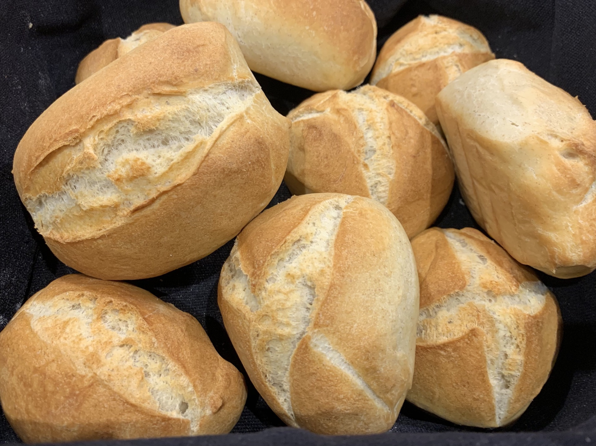

# Frühstücksbrötchen

## Zutaten

|Menge|Zutat|
|-----|---------------------------|
|25g  |Roggenvollkornmehl         |
|500g |Weizenmehl Typ 550         |
|125g |kaltes Wasser              |
|200g |kalte Milch mind. 3,5% Fett|
|4,1g |Frische Hefe               |
|10g  |Butter                     |
|10g  |Salz                       |

## Zeit

* ca. 30 Minuten Zubereitung
* 24 Stunden gehen lassen
* 18 Minuten backen

## Zubereitung

### Vorteig

|Menge|Zutat             |
|-----|------------------|
|25g  |Roggenvollkornmehl|
|100g |Weizenmehl Typ 550|
|125g |kaltes Wasser     |
|0,1g |frische Hefe      |

Alle Zutaten gut vermischen und anschließend 12-16 Stunden bei Raumtemperatur gehen lassen.

### Hauptteig

|Menge |Zutat                      |
|------|---------------------------|
|1 Stk.|Vorteig                    |
|400g  |Weizenmehl Typ 550         |
|200g  |kalte Milch mind. 3,5% Fett|
|4g  |Frische Hefe               |
|10g   |Butter                     |
|10g   |Salz                       |

Alle Zutaten in eine Küchenmaschine geben und 5 Minuten auf Stufe 1 kneten.  
Anschließend nochmal 4-5 Minuten auf Stufe 2.  
Den Teig bei ca. 5°C für 6-12 Stunden ruhen lassen.

### Backen

Den Teig vorsichtig aus der Schüssel nehmen und ca. 10 Brötchen abstechen.  
Den Ofen auf 240°C vorheizen. Die Brötchen in den Ofen geben und die Temperatur auf 220°C runterstellen.  
Nach ca. 18 Minuten sind die Brötchen fertig.

## Foto

