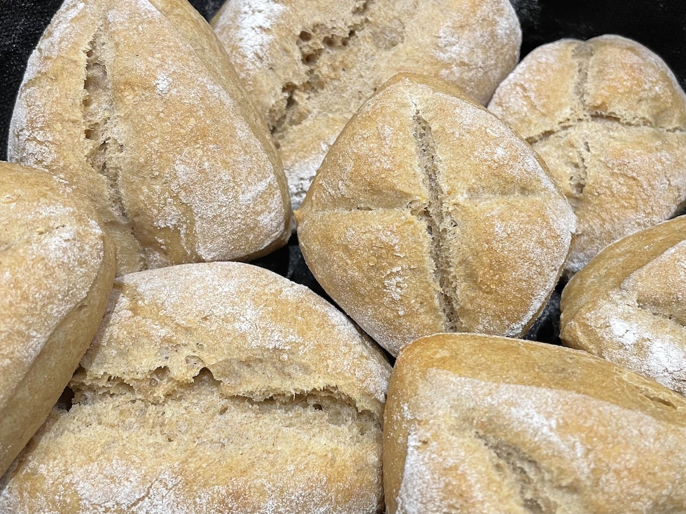

# Kartoffelbrötchen

## Zutaten

|Menge      |Zutat             |
|-----------|------------------|
|255g       |Kartoffeln        |
|100g       |Roggenvollkornmehl|
|150g       |Weizenmehl 550    |
|45g        |Wasser            |
|1 Esslöffel|Olivenöl          |
|2-3g       |Trockenhefe       |
|1 Teelöffel|Salz              |

## Zeit

* ca. 30 Minuten Zubereitung
* 8-10 Stunden gehen lassen
* 20-25 Minuten backen

## Zubereitung

Die Kartoffeln weich kochen, abkühlen lassen und zerdrücken.  
Das Olivenöl samt Salz mit den Kartoffeln vermischen und die Hefe dazugeben.  
Dann 10 Minuten lang Mehl und Wasser auf niedriger Stufe unterkneten.  
Den Teig über Nacht bzw. etwa 8-10 Stunden im Kühlschrank ruhen lassen.  
Anschließend Brötchenteiglinge abstechen, wirken, schleifen und in Roggenmehl wälzen.  
Die Rohlinge noch 50-60 Minuten bei Zimmertemperatur gehen lassen.  
Inzwischen den Ofen auf 250°C vorheizen. Die Brötchen mit viel Dampf in den Ofen schieben, 
nach 10 Minuten auf 190°C herunterregeln und weitere 10-15 Minuten goldbraun backen.  
Die Kartoffelbrötchen sollten noch etwa 15-30 Minuten abkühlen bevor sie angeschnitten werden.

## Credits

Die Basis kommt von [Petras Brotkasten](http://www.petras-brotkasten.de/Brotkart.html)

Weiter entwicklet von [Plötzblog](https://www.ploetzblog.de/2009/08/30/gebacken-kartoffelbroetchen/)

## Foto

