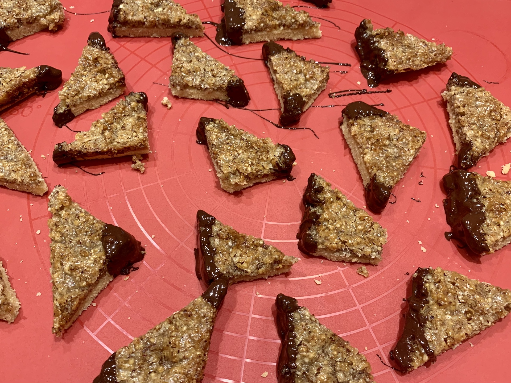

# Nussecken

## Zutaten

|Menge      |Zutat               |
|-----------|--------------------|
|500g       |Weizenmehl          |
|590g       |Margarine           |
|530g       |Zucker              |
|2          |Eier                |
|2 Päckchen |Vanillezucker       |
|8 Esslöffel|Wasser              |
|560g       |gemahlene Haselnüsse|
|150g       |Aprikosenmarmelade  |
|           |Schokolade          |

## Zeit

* ca. 30 Minuten Zubereitung
* 2x 20 Minuten backen

## Zubereitung

### Vorbereitung

Ein Backblech mit Margarine einschmieren oder mit Backpapier auslegen.  
Den Ofen auf 175°C vorheizen.

### Mürbeteig herstellen

|Menge|Zutat     |
|-----|----------|
|500g |Weizenmehl|
|250g |Margarine |
|130g |Zucker    |
|2    |Eier      |

Alle Zutaten mischen und auf dem Backblech ausrollen.

### Masse herstellen

|Menge      |Zutat               |
|-----------|--------------------|
|340g       |Margarine           |
|400g       |Zucker              |
|2 Päckchen |Vanillezucker       |
|8 Esslöffel|Wasser              |
|560g       |gemahlene Haselnüsse|

Die Zutaten (außer die Haselnüsse) in einem Topf aufkochen lassen.  
Nach dem Aufkochen die gemahlene Nüsse unterheben.

### Letzte Schritte

|Menge      |Zutat               |
|-----------|--------------------|
|1 Stk.     |Mürbeteig           |
|1 Stk.     |Masse               |
|150g       |Aprikosenmarmelade  |
|           |Schokolade          |

Den ausgerollten Mürbeteig mit der Aprikosenmarmelade bestreichen.  
Anschließend die noch heiße Masse darauf verteilen.  
Bei 175°C ca. 25-30 Minuten backen.  
Nach dem Backen abkühlen lassen und nach belieben mit Schokolade verzieren.

## Foto

