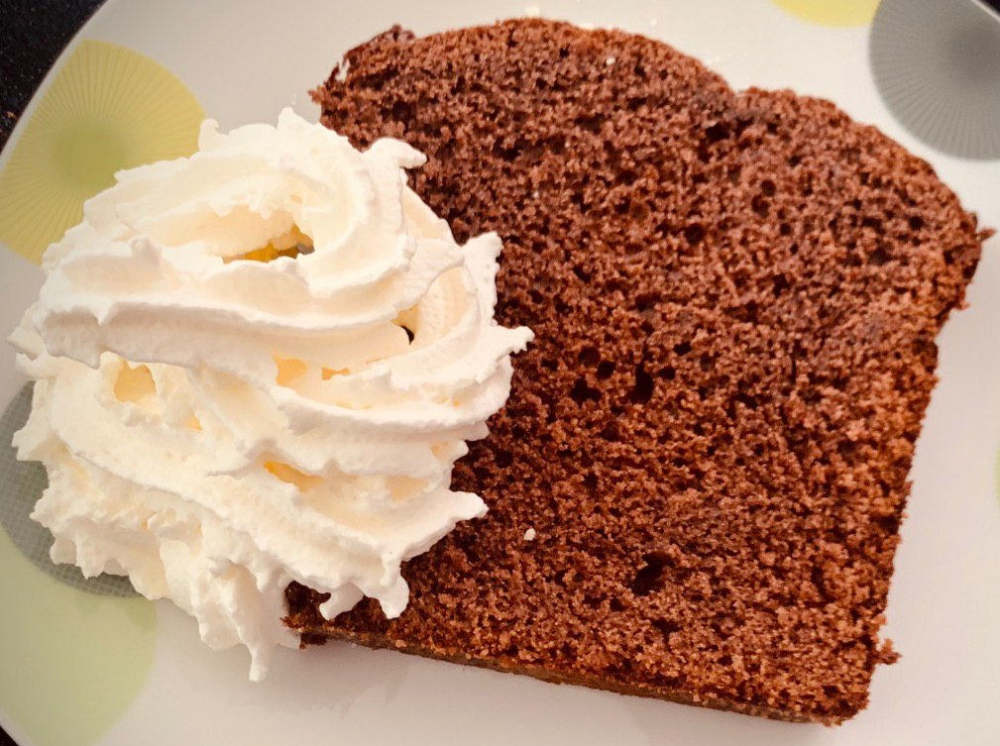

# Schokoladenrührkuchen

## Zutaten

|Menge      |Zutat        |
|-----------|-------------|
|250g       |Butter       |
|2 Tassen   |Zucker       |
|3 Esslöffel|Kakao        |
|½ Tasse    |Wasser       |
|3 Tassen   |Mehl         |
|4          |Eier         |
|1 Päckchen |Vanillezucker|
|1 Päckchen |Backpulver   |

## Zeit

* ca. 15 Minuten Zubereitung
* 20-45 Minuten backen (je nach Form)

## Zubereitung

Eine Kastenform (oder ein Backblech, dann die doppelte Menge!) mit Butter/Margarine ausstreichen.

|Menge      |Zutat        |
|-----------|-------------|
|250g       |Butter       |
|2 Tassen   |Zucker       |
|3 Esslöffel|Kakao        |
|½ Tasse    |Wasser       |

Diese Zutaten in einem Topf verrühren und auf dem Herd dünn werden lassen.

|Menge      |Zutat        |
|-----------|-------------|
|1 Stk.     |dünne Masse  |
|3 Tassen   |Mehl         |
|4          |Eier         |
|1 Päckchen |Vanillezucker|
|1 Päckchen |Backpulver   |

Alle Zutaten in einer Schüssel verühren und in eine Kastenform oder auf das Backblech geben.  
Bei 180°C ca. 20-45 Minuten (je nach Form) backen und mit einem Stäbchen testen, ob der Kuchen fertig ist.

## Foto

