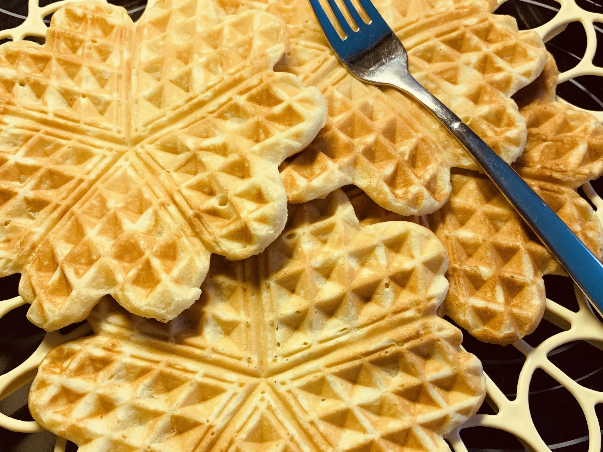

# Waffeln

## Zutaten

|Menge     |Zutat        |
|----------|-------------|
|250g      |Margarine    |
|500g      |Mehl         |
|250g      |Zucker       |
|1 Prise   |Salz         |
|1 Päckchen|Vanillezucker|
|1 Päckchen|Backpulver   |
|6         |Eier         |
|etwas     |Milch        |

## Zeit

* ca. 10 Minuten Zubereitung

## Zubereitung

Alle Zutaten mischen und Milch hinzugeben, bis der Teig relativ flüssig ist.

## Foto

